# BeautyXP

Smart Skincare Analysis and Recommendation App.

## Group Information

**Group Name:** WonderXP

**Group Members:**
- Deenna Rainisa binti Zainudin (2319140) - Group Leader
- Nur Sofiatunnisa’ Binti Mohd Zaki (2212008)
- Mashitah binti Nordin (2111110)

## Project Task Distribution

| Member | Module | Responsibilities | Deliverables |
|--------|--------|------------------|--------------|
| **Mashitah binti Nordin (2111110)** | User Management Module | • Login Screen • Register Screen • Logout Function • Firebase Authentication • User Profile Screen • Profile Update Function • Input Validation (Email & Password) • Home Screen | • Users can create accounts • Users can log in and log out • Users can update profile information |
| **Nur Sofiatunnisa' Binti Mohd Zaki (2212008)** | Skin Analysis Module | • Camera Integration • Capture Selfie • Image Preview Screen • Questionnaire Screen • Skin Type Calculation Logic • Save Analysis Result | • Users can capture a selfie • Users can answer the skin analysis questionnaire • App determines the user's skin type |
| **Deenna Rainisa binti Zainudin (2319140)** | Recommendation & Database Module | • Firestore Product Database • Recommendation Logic • Budget Selection Screen • Recommendation Result Screen • Analysis History Screen • Delete Analysis History | • Users receive skincare recommendations • Analysis history is stored and displayed • CRUD operations are implemented |

### Shared Responsibilities

| Task | Distribution |
|------|--------------|
| Documentation | Mashitah – Project Initiation Sofia – Requirement Analysis & Planning Deenna – System Design |
| README.md | All members contribute to their respective sections. |
| GitHub | All members create branches, commit code, and merge changes. |
| Presentation | Each member presents their assigned module, implementation, and contribution. |

### Screen Ownership

| Screen | Owner |
|--------|-------|
| Login | Mashitah |
| Register | Mashitah |
| Home | Mashitah |
| Camera Capture | Sofia |
| Questionnaire | Sofia |
| Analysis Result | Sofia |
| Budget Selection | Deenna |
| Recommendation | Deenna |
| Analysis History | Deenna |

# Project Ideation and Initiation

## 1. Application Title

**BeautyXP: Smart Skincare Analysis and Recommendation App**

## 2. Background

Many people struggle to identify their actual skin type and skin condition, causing them to purchase skincare products based on advertisements, social media trends, or influencer recommendations rather than their personal needs. As a result, they may experience ineffective skincare routines, skin irritation, and unnecessary spending.

BeautyXP is developed to solve this problem by providing AI-assisted skin analysis and a skin type questionnaire. Based on the analysis results, the application recommends suitable skincare products according to the user's skin condition and preferred budget, helping users make more informed skincare decisions.

## 3. Purpose and Objectives

The purpose of BeautyXP is to help users better understand their skin and recommend skincare products that match their skin type, skin condition, and budget.

**Objectives**
- Identify the user's skin condition using AI-assisted image analysis.
- Determine the user's skin type through a questionnaire.
- Recommend suitable skincare products based on the analysis results.
- Provide recommendations within the user's preferred budget category (Budget, Mid-range, or Premium).
- Simplify the process of selecting suitable skincare products.

## 4. Target Users

BeautyXP is designed primarily for beginners who need guidance in choosing suitable skincare products. The application targets university students and working adults who are interested in skincare but may not have sufficient knowledge to identify their skin type or select appropriate products. It is suitable for both male and female users.

## 5. Features and Functionalities

- User registration and login authentication.
- AI-assisted skin analysis using the smartphone camera.
- Skin type analysis through a questionnaire.
- Personalized skincare product recommendations.
- Budget selection (Budget, Mid-range, and Premium).
- Analysis history.
- User profile management.

## 6. Why We Chose This Idea

Our group chose this project because skincare has become increasingly important in everyday life, yet many people still struggle to identify their skin type and choose suitable products. BeautyXP combines AI-assisted skin analysis, personalized skincare recommendations, and budget-based product suggestions into a single mobile application. By providing recommendations tailored to each user's needs, the application helps users make more confident, informed, and cost-effective skincare decisions.

# Requirement Analysis & Planning

## 1. Technical Feasibility and Platform Compatibility

### Chosen Platform & Framework

BeautyXP is developed for smartphone platforms (Android and iOS) using the **Flutter framework**, which supports cross-platform mobile development. This allows the application to run on both Android and iOS devices using a single Dart codebase.

Smartphones are the most suitable platform for BeautyXP because they come with built-in cameras and storage, which are essential for capturing and saving selfie images used in skin analysis.

Flutter was chosen because it improves development efficiency by allowing developers to build one application for multiple platforms. This reduces development time, effort, and maintenance costs since there is no need to create separate applications for different operating systems.

In addition, Flutter provides many ready-made packages and plugins that simplify integration with device hardware such as the camera. It also supports easy integration with Firebase, which is used for authentication, data storage, and saving skin analysis results. This makes the application more scalable and easier to maintain.

## 2. Data Storage and CRUD Operations

BeautyXP uses both **local storage** and **cloud storage** to manage user data and analysis results.

### Local Storage
Local storage is implemented using the `shared_preferences` plugin. It is used to store the latest skin profile so that the Home screen can quickly display the most recent analysis without requiring users to repeat the process.

The Skin Result page stores temporary data such as:
- Skin concern prediction
- Confidence score
- Image path
- Firestore document ID

### Cloud Storage (Firebase Firestore)
Firebase Firestore is used as the main backend database. It stores:
- User skin analysis records
- Skin type and skin condition
- Selected budget
- Recommended products

When a user completes an analysis, a new record is created in Firestore. Existing records can also be updated with questionnaire results, budget selection, and recommendations.

### CRUD Operations
- **Create:** New skin analysis records are created after AI analysis, questionnaire completion, and recommendation generation.
- **Read:** Data is displayed on Home and History screens.
- **Update:** Records are updated with skin type, budget, and recommendations.
- **Delete:** Users can delete saved analysis history.

## 3. Hardware Integration, Packages, and Plugins

The application uses smartphone hardware and Flutter plugins to support core features.

### Hardware Used
- Smartphone camera (for selfie capture and skin analysis)
- Device speaker (for camera shutter sound)

---

### Flutter Packages & Plugins

| Package | Version | Function |
|----------|----------|----------|
| cupertino_icons | ^1.0.8 | iOS-style icons |
| camera | ^0.12.0+1 | Access device camera and capture images |
| audioplayers | ^5.2.1 | Plays camera shutter sound |
| path_provider | ^2.1.6 | Access device storage directories |
| path | ^1.9.1 | Manage file paths |
| tflite_flutter | ^0.12.1 | Run TensorFlow Lite AI model |
| image | ^4.9.1 | Image preprocessing for AI model |
| shared_preferences | ^2.5.5 | Local storage for latest skin data |
| firebase_core | ^3.15.1 | Initialize Firebase |
| cloud_firestore | ^5.6.12 | Cloud database for analysis records |

## 4. Device Compatibility (Smartphone / Wearable)

BeautyXP is primarily designed for **smartphones** because its main features require a camera, screen interaction, and detailed result viewing.

Smartphones are ideal for:
- Capturing selfies for skin analysis
- Viewing analysis results clearly
- Completing questionnaires
- Browsing product recommendations and history

Wearable devices such as smartwatches are not fully supported due to limited screen size and lack of suitable camera functionality for AI-based skin analysis.

However, wearable support can be considered as a future enhancement. Possible features include:
- Skincare reminders
- Daily beauty tips notifications
- Viewing basic skin status summary
- Skincare routine tracking

## 5. Diagrams 

### Sequence Diagram

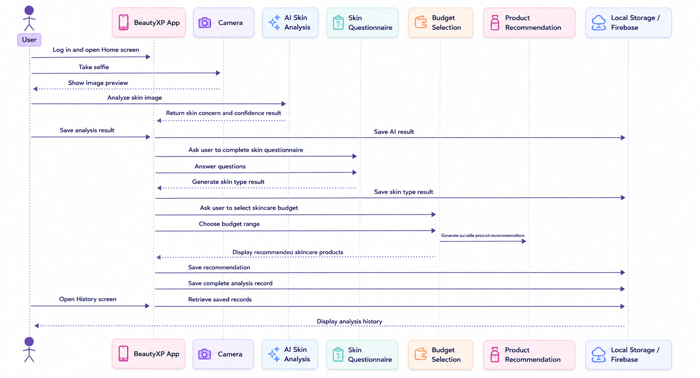

---

### Navigation Flow Diagram

  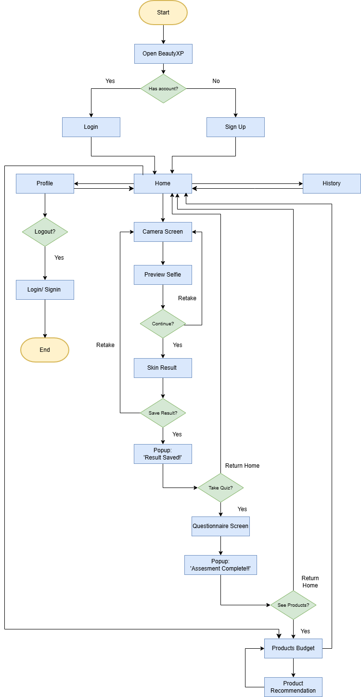

## 6. Planning

The project planning is organized using a Gantt Chart to ensure all tasks are completed within the timeline and distributed evenly among team members.

### Gantt Chart

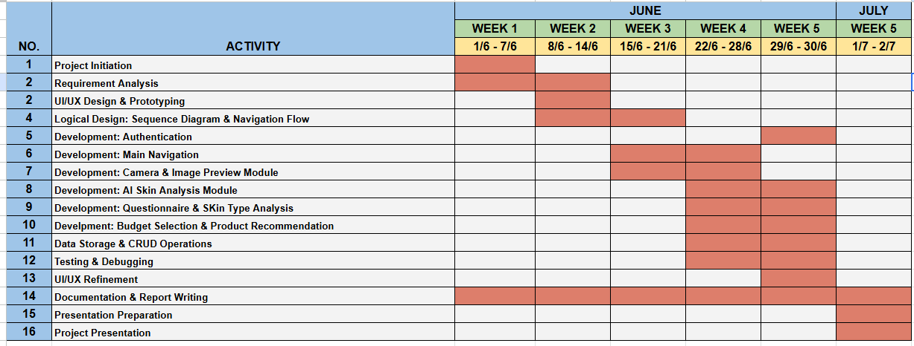

# PROJECT DESIGN

## 1. User Interface (UI)

The application uses a modern and minimalist design with a purple and white theme. Flutter Material Design ensures consistency across all screens.

---

### Login Screen

  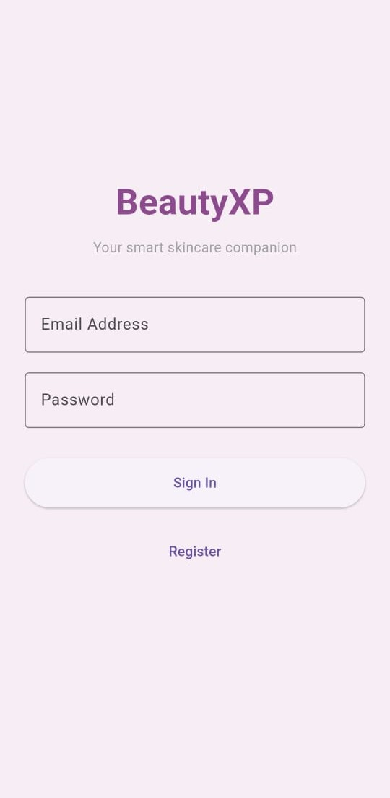

The Login Screen allows users to log into their account using email and password. New users can navigate to the Sign Up page.

---

### Sign Up Screen

  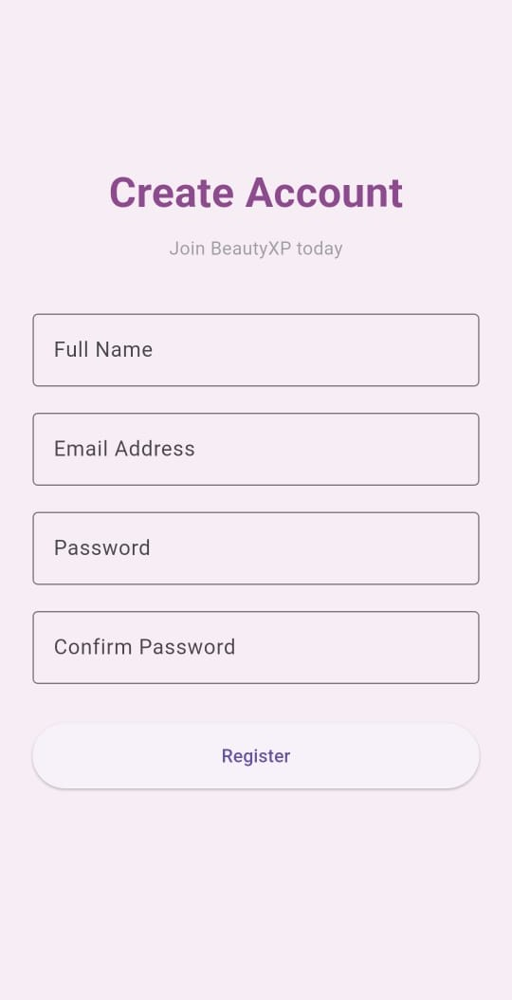

The Sign Up Screen allows new users to create an account by entering their details. After registration, users can log in to the app.

---

### Home Screen

  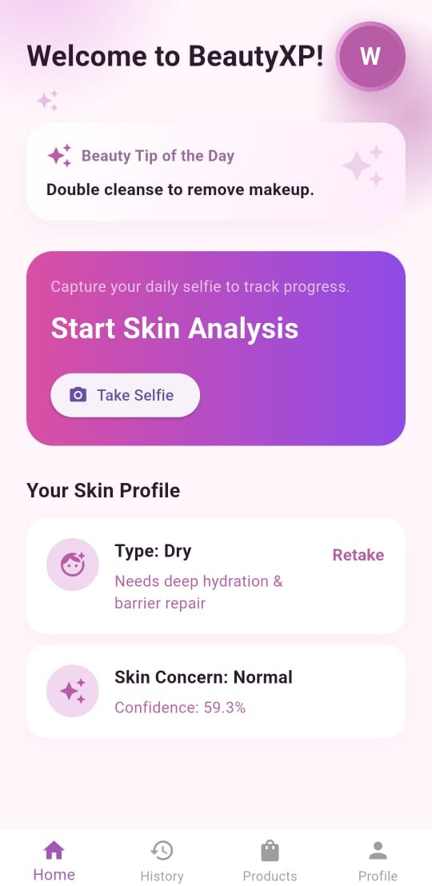

The Home Screen acts as the main dashboard and provides access to Skin Analysis, Recommendations, History, and Profile.

---

### Skin Analysis (Selfie Capture)

  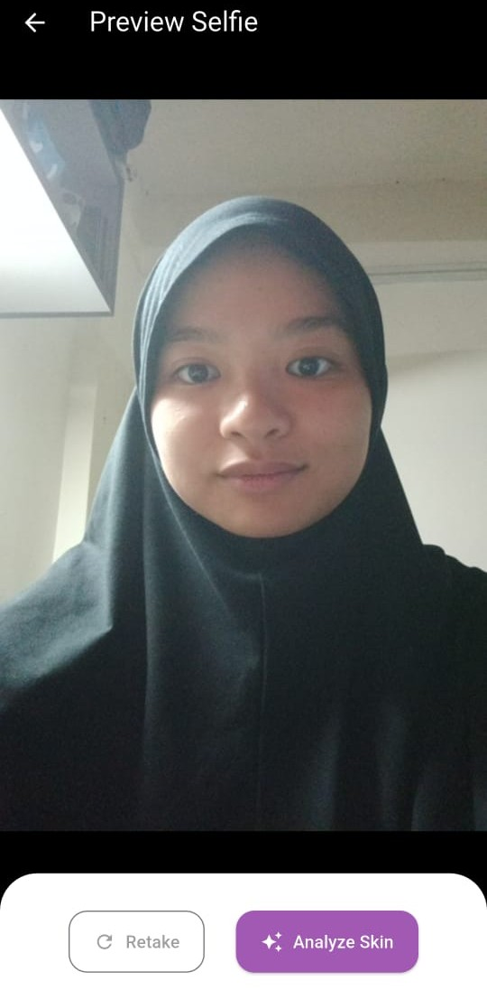

Users capture a selfie using the camera for AI-based skin analysis. They can preview or retake the image before continuing.

---

### Skin Assessment Quiz Screen

  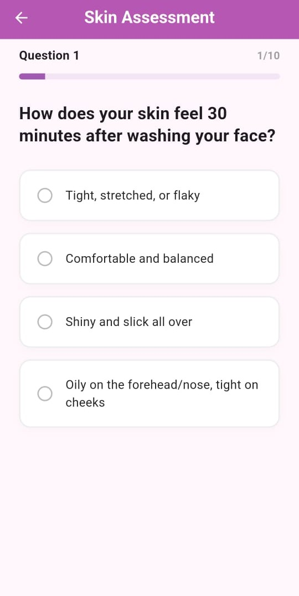

Users answer questions related to their skin type to improve analysis accuracy.

---

### Budget Selection Screen

  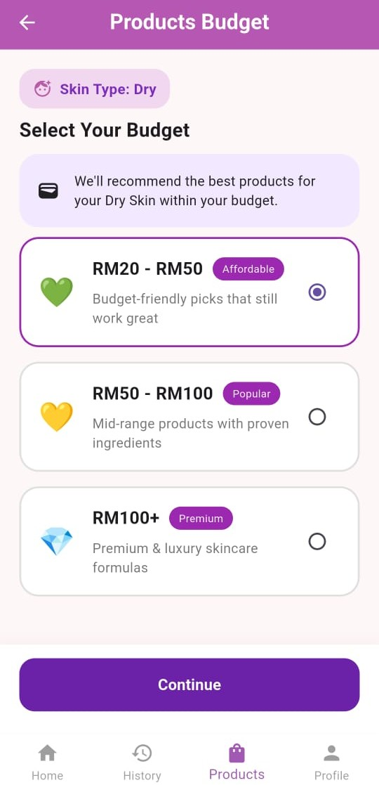

Users select their preferred budget category: Budget, Mid-range, or Premium.

---

### Recommendation Screen

  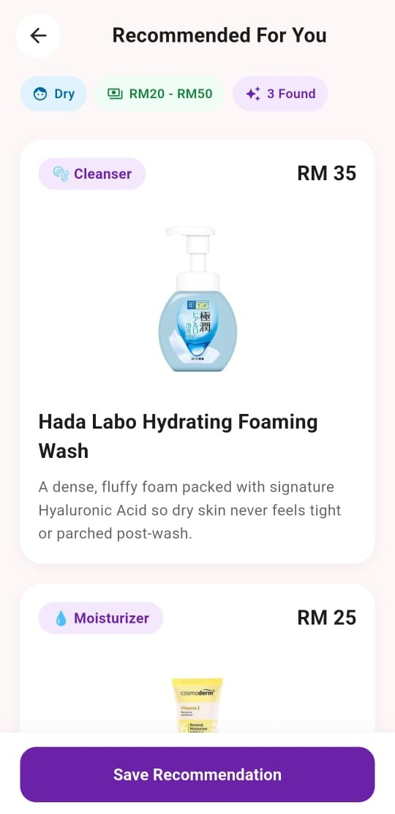

Displays personalized skincare product recommendations based on analysis and budget selection.

---

### Analysis History Screen

  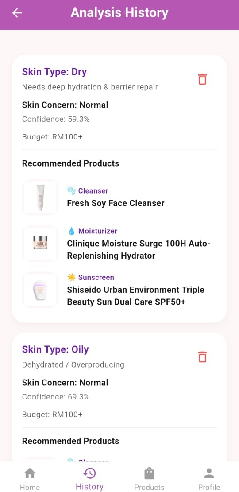

Stores previous analysis results and recommendations for easy reference.

---

### Profile Screen

  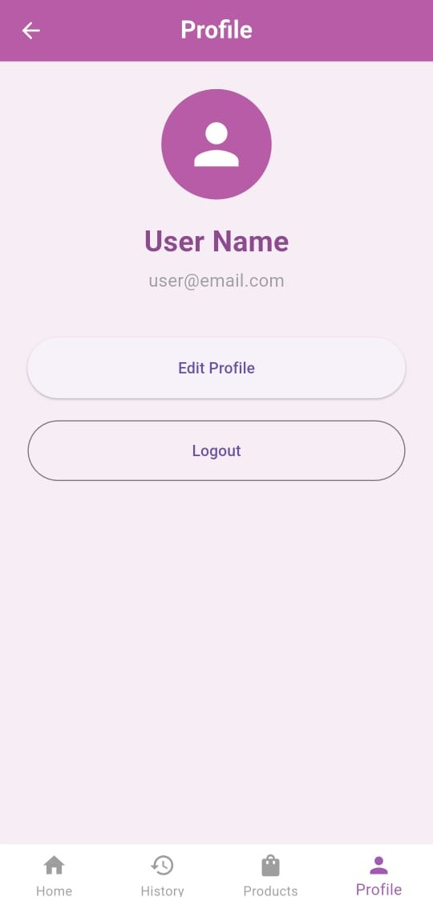

Displays user profile information and logout option.

## 2. User Experience (UX)

The app is designed to be simple, clean, and easy to navigate.

### Navigation
- Easy movement between screens  
- Clear buttons and icons  
- Home screen acts as central navigation  

---

### Forms
- Simple input fields  
- Validation messages  
- Clear labels  

---

### Buttons
- Consistent purple theme  
- Large mobile-friendly buttons  
- Easy to tap and recognize  

## 3. Consistency

The app maintains consistency across all screens:

- Same purple & white theme  
- Same font style  
- Same button design  
- Same spacing  
- Same icon style  

# PROJECT DEVELOPMENT

## 1. Functionality

BeautyXP is a smart skincare analysis and recommendation mobile application that allows users to analyse their skin condition and receive personalised skincare product recommendations.

The application begins with a login and registration interface, followed by a home screen that provides access to four main modules: skin analysis, product recommendations, history, and user profile.

The skin analysis module allows users to capture a selfie using the device camera and complete a questionnaire to determine their skin type. The system then processes the input to generate a skin type result.

After completing the skin analysis, users can proceed to the product recommendation module. The application provides skincare product suggestions based on the user’s skin type and selected budget category (Budget, Mid-range, or Premium).

Users are also able to save their preferred products. Saved data is stored in Firebase Firestore and can be viewed or deleted in the history module.

## 2. Code Quality (Modular Architecture)

The application follows a modular architecture using Flutter best practices. Each screen is separated into individual files under the `lib/screens` directory to improve maintainability and readability.

### Main Screens
- login_screen.dart  
- home_screen.dart  
- main_screen.dart  
- budget_selection_screen.dart  
- history_screen.dart  
- profile_screen.dart  
- recommendation_screen.dart  

The application uses an `IndexedStack` inside `MainScreen` to manage navigation efficiently without unnecessary screen rebuilding.

Reusable widgets such as the bottom navigation bar are placed in the `widgets` directory, while data models and services are separated into `models` and `services` directories.

## 4. Error Checking and Validation

The application implements validation mechanisms to ensure correct user flow and data integrity.

- Users must complete both selfie capture and questionnaire before generating results  
- Recommendations are only shown after completing skin analysis and selecting budget  
- Questionnaire is sequential and cannot be skipped  
- Firebase Firestore includes error handling for safe CRUD operations  

## 5. GitHub Collaboration

The project was developed collaboratively using GitHub for version control. Each team member worked on separate branches based on their assigned modules before merging into the main branch.

- Authentication module  
- Camera and skin analysis module  
- Recommendation module  

Pull requests were used to manage code integration, ensuring proper version control and reducing conflicts during merging.

## 6. Use of Generative AI Tools (Declaration)

During the development of this project, generative AI tools such as **ChatGPT** and **Google Gemini** were used for **assistance and enhancement purposes only**.

However, the **original project idea, system design, implementation, and core functionality were fully developed by the project team members**.

All AI-generated content was reviewed, edited, and adapted by the team to ensure accuracy and alignment with the project requirements.

## 7. References

AJ Tech Tutorials. (2026, February 11). *How To Setup Firebase Firestore Database [2026 guide]* [Video]. YouTube. https://www.youtube.com/watch?v=B5hWIyw6Ztw  

John Elder. (2022, September 16). *Add images to your app (TWO METHODS!) - Flutter Friday 5* [Video]. YouTube. https://www.youtube.com/watch?v=mON4IupMyfo  

Hussain Mustafa. (2024, June 4). *Flutter Camera App Tutorial | Access Device Camera, Take & Save Pictures/Video* [Video]. YouTube. https://youtu.be/TrmoRtn5MZA?si=46d4tq0l0U0sUp2S  

Flutter Documentation. https://docs.flutter.dev/  

MobileNetV2 Model Reference: https://colab.research.google.com/drive/1w4MhfN9JQRwHPVyUHA4Yhx9ltRA6H9Hi?usp=sharing  
